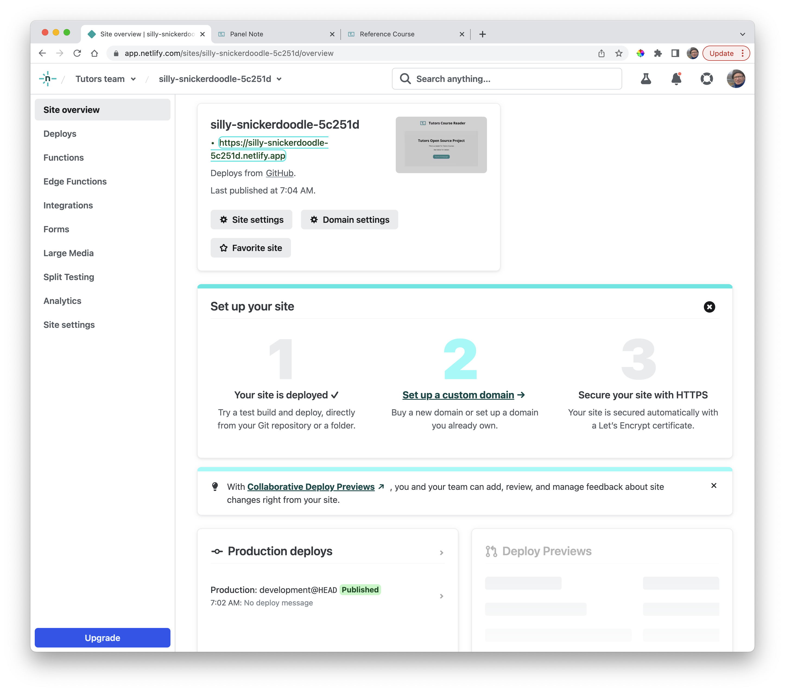
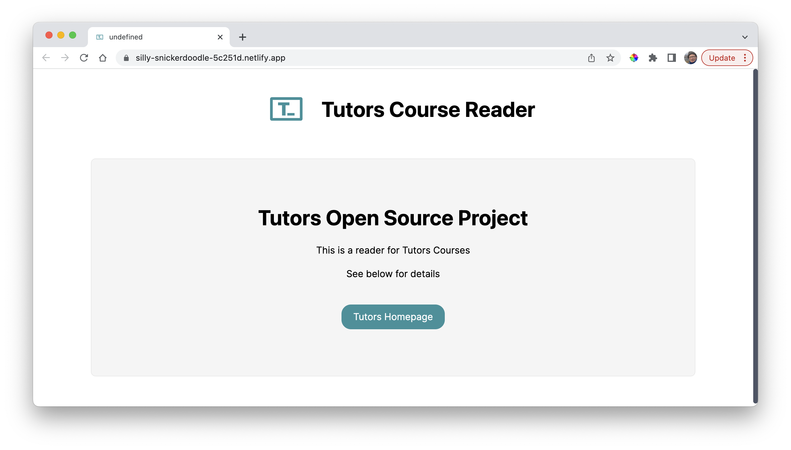
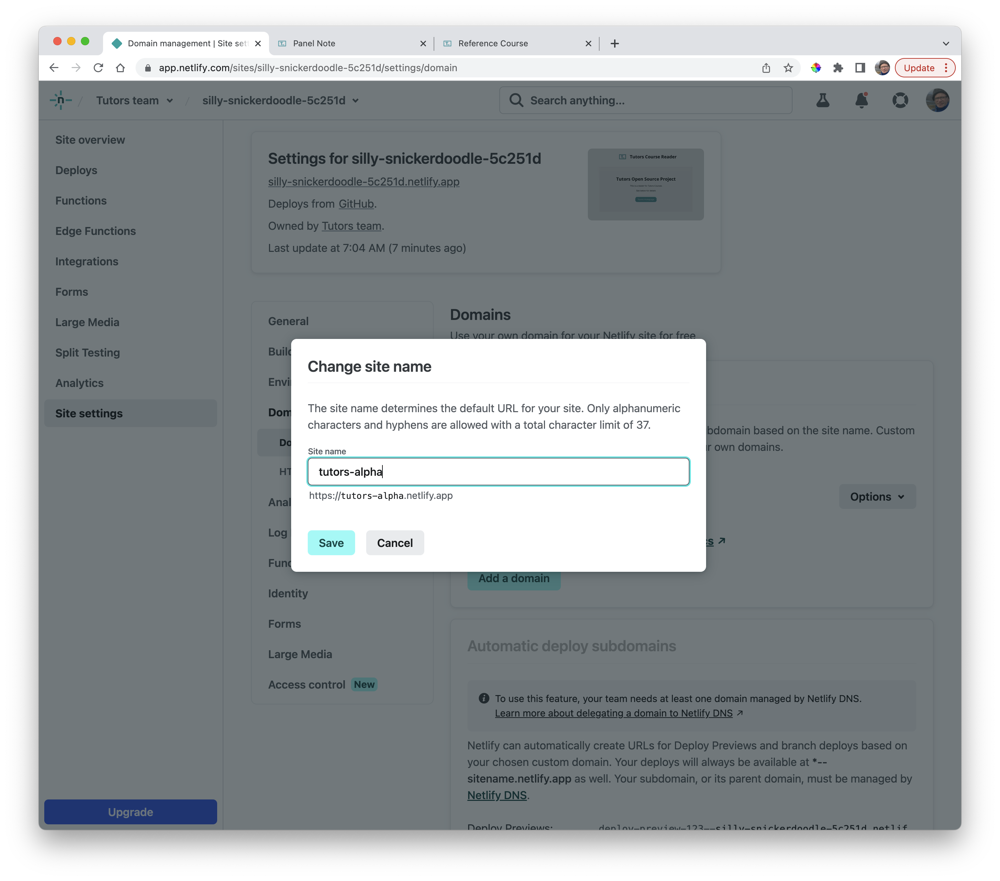

# Launch

Switch to `Site Overview`:

You will see the Netlify generated domain name - if you select it the reader will be launched:

You can modify this domain name to something more appropriate. Select `Domain settings' and then `Options->Edit Site Name`:

