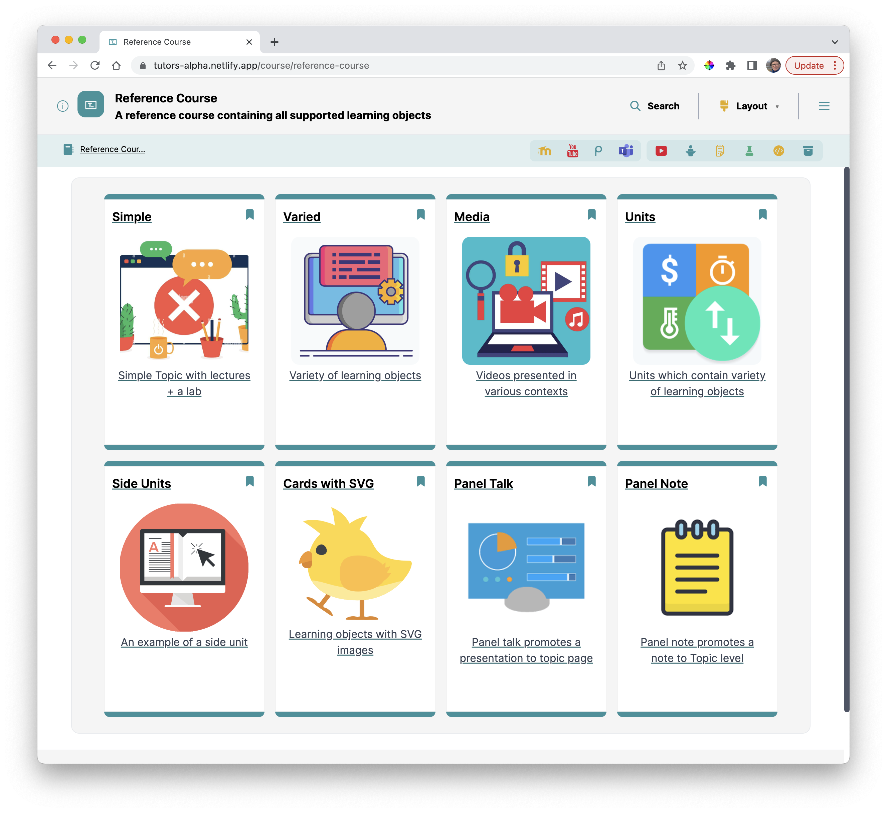

# Open a Course

Recall how a course is opened using the default reader:

- <https://reader.tutors.dev/course/reference-course>

We have a new reader deployed now at a url like this (yours will be different):

- <https://tutors-alpha.netlify.app/>

Modify the url, keeping the domain, but appending the url segments from `/course/` on:

- https://tutors-alpha.netlify.app/course/reference-course

You now have your custom reader deployed.