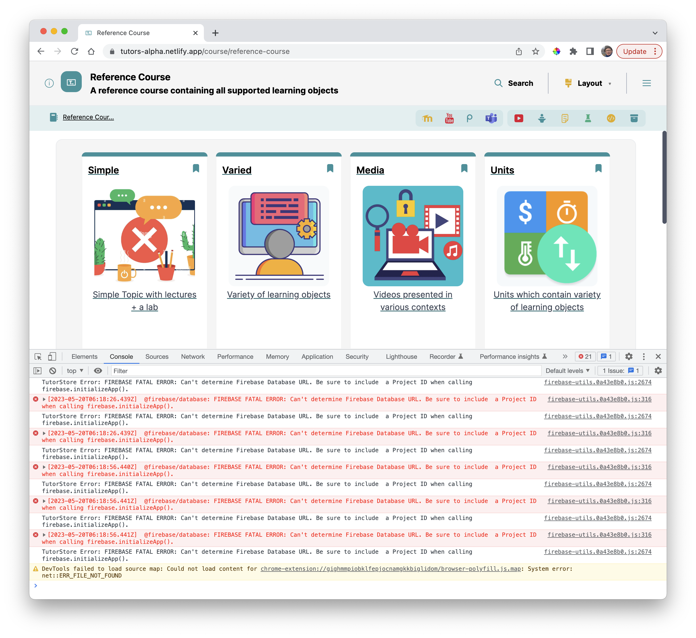
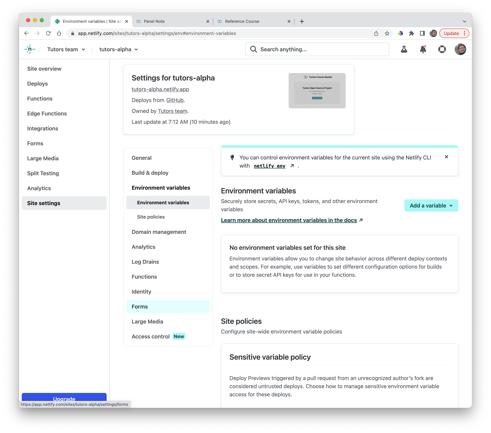
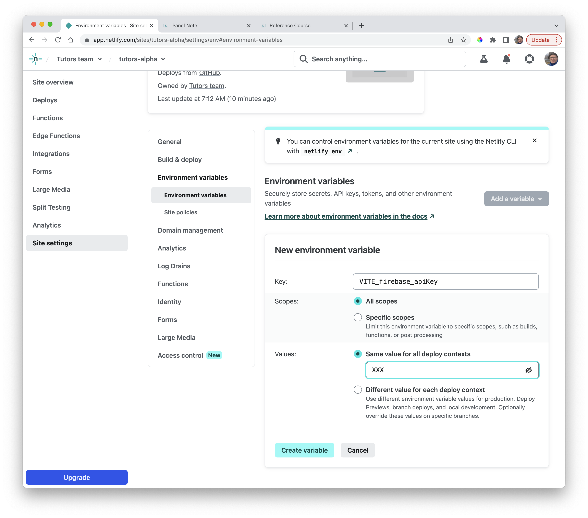
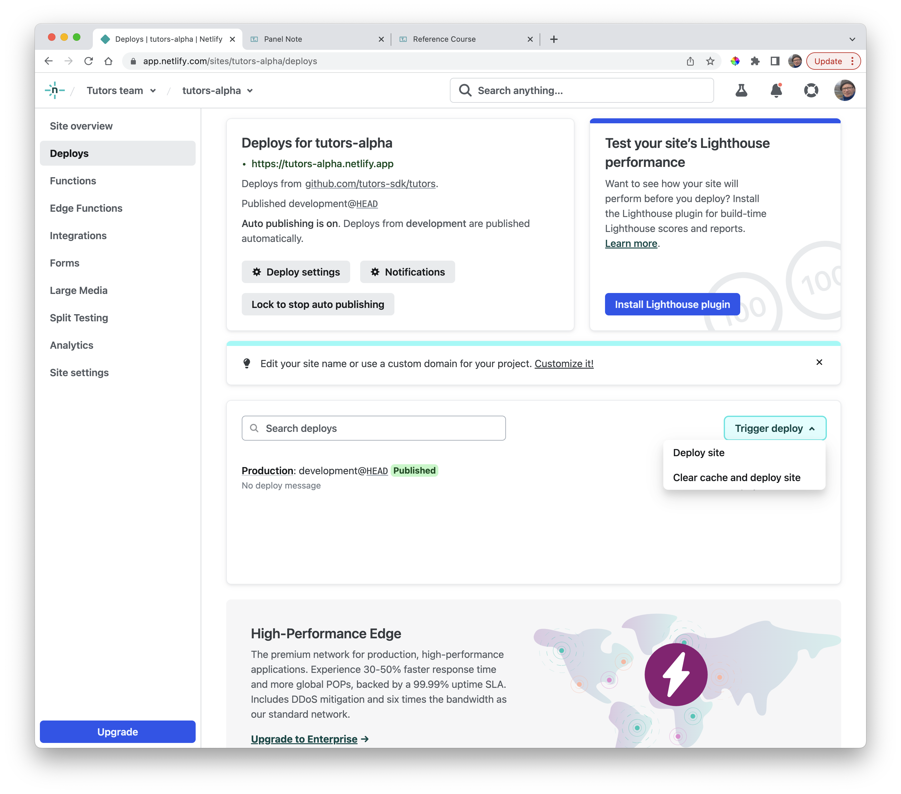

# Environment Variables (Optional)

Tutors uses Firebase + Auth0 services for logging and authentications purposes. These require some API keys to access. We have not provided these, so the reader will be logging some errors to the browser console:

If you wish to eliminate this noise, then you can set up some dummy environment variables on Netlify:

Introduce a new variable:

- VITE\_firebase\_apiKey

Set this to:

- XXX

Then redeploy the app:

This will remove most of the logged errors, but not completely eliminate them all. If you wish to completely incorporate the Firebase & Auth0 services, you will need to provide keys for all of these values:

~~~bash
VITE_auth0_clientId = "XXX"
VITE_auth0_domain = "XXX"
VITE_auth0_customdomain = "XXX"
VITE_auth0_redirectUri = "XXX"
VITE_firebase_apiKey = "XXX"
VITE_firebase_databaseUrl=  "XXX"
VITE_firebase_projectId = "XXX"
VITE_tutors_store_id = "XXX"
VITE_tutors_store_secret= "XXX"
~~~

These can be sourced from signing up for developer accounts, and creating projects, on:

- https://firebase.google.com/
- https://auth0.com/

The Tutors reader will work perfectly fine without these services, unless you wish to enable authentication on your courses.