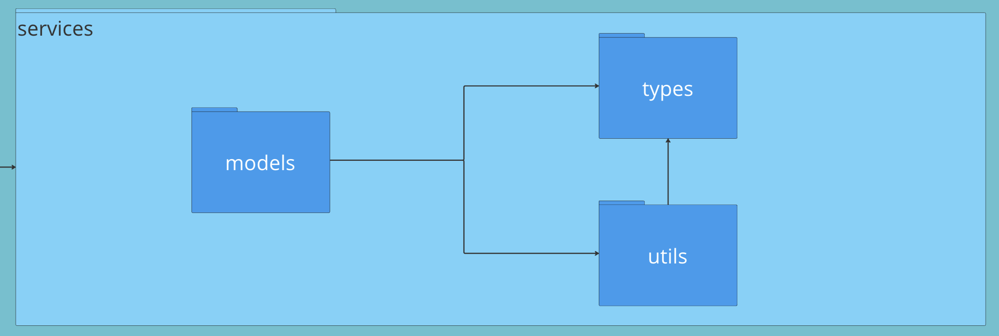
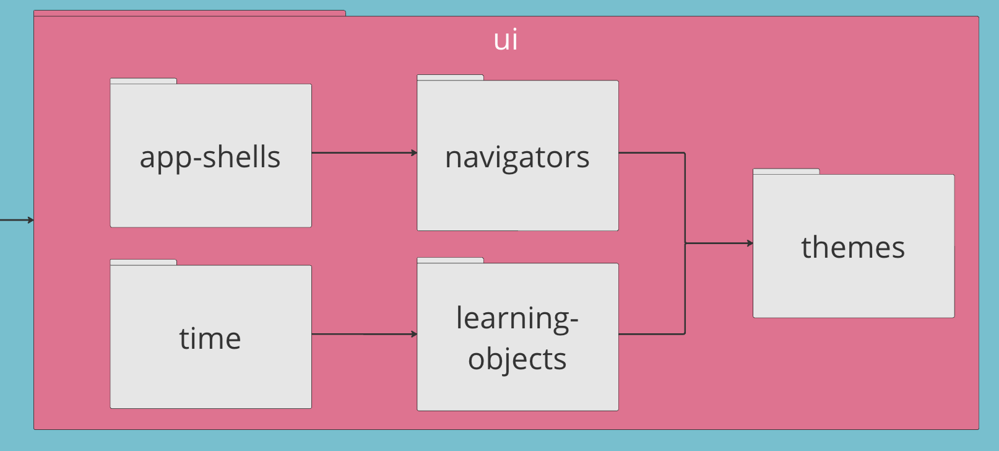
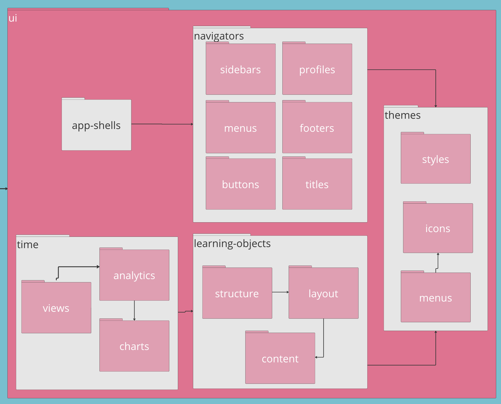

---
icon:
  type: flat-color-icons:library
---

## Tutors Architecture

A tour of the Tutors Reader source

The Tutors Reader is a [SvelteKit](https://kit.svelte.dev/) web application, packaged as a single source repository:

- <https://github.com/tutors-sdk/tutors>

The top level perspective the application is structure these top level components: 

- Lib: Tutors Components
- Routes: Tutors Applications

### Lib

The Tutors Lib components consists of two sub systems:

- Services: containing the core tutors models, types and utilities
- Ui: package containing the ui components used by the Tutors Applications

### Lib/Services

The Services package defines three packages:

- Types: core types use through the tutors applications
- Utils: a set of utility functions supporting these types
- Models: Core model objects: Course, Analytics & Presence

### Lib/UI

The UI package encapsulate families of UI components, in 4 top level packages:

- App-shells: application window layouts

- navigators: headers menus and sidebars

- time: Tutors Time components

- Learning-objects: Core learning object representation

- themes: The Tutors Reader Themes

### Lib/UI Detail

