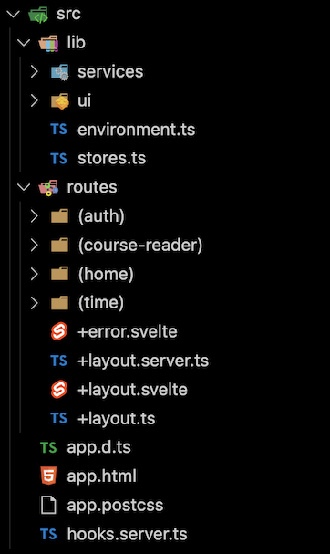

---
icon:
  type: flat-color-icons:library
---

## Tutors Architecture

A tour of the Tutors Reader source

The Tutors Reader is a [SvelteKit](https://kit.svelte.dev/) web application, packaged as a single source repository:

- <https://github.com/tutors-sdk/tutors>

The src folder is the heart of the application, structure into 

- Lib: core tutors information + ui models
- Routes: the tutors reader components

