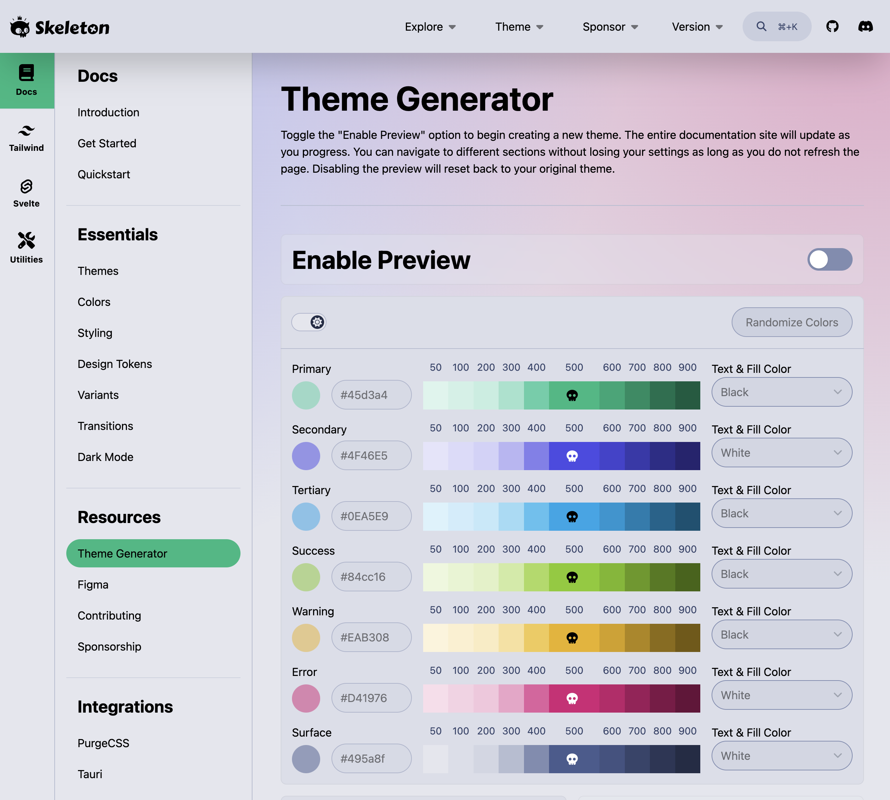

# Explore the Theme Builder

The Tutors Reader uses the [Skeleton framework](https://www.skeleton.dev/). This has a useful theme builder:

- <https://www.skeleton.dev/docs/generator>

This has a dialog revealing a full range of customisable design options:

If you `Enable Preview` then you will have a live view of any adjustments you make to the core 
