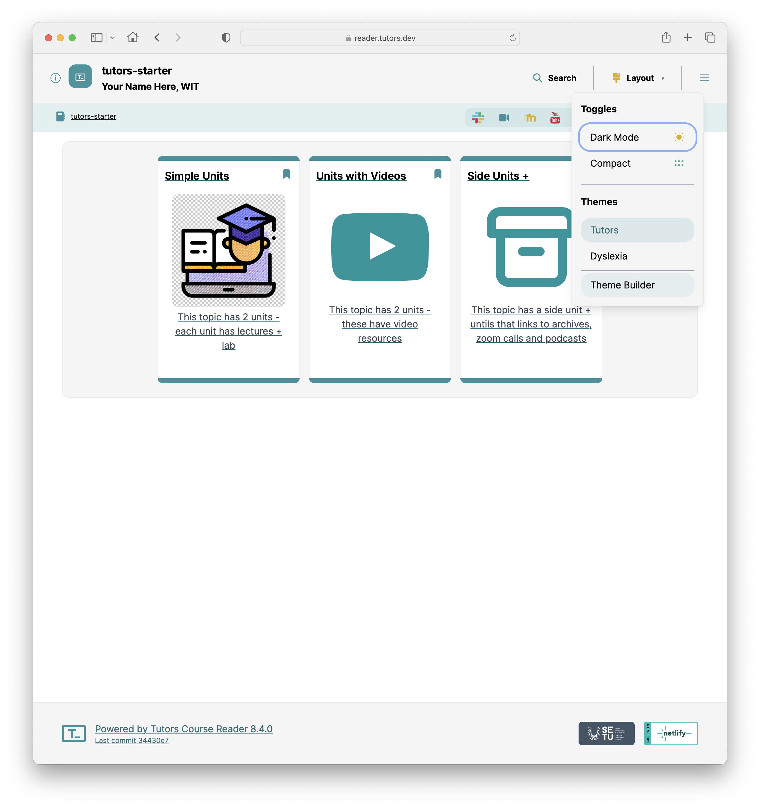
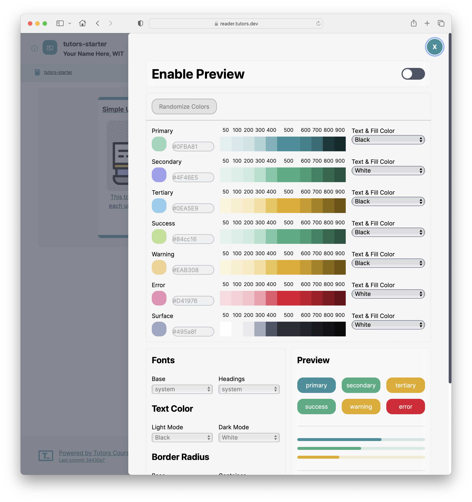
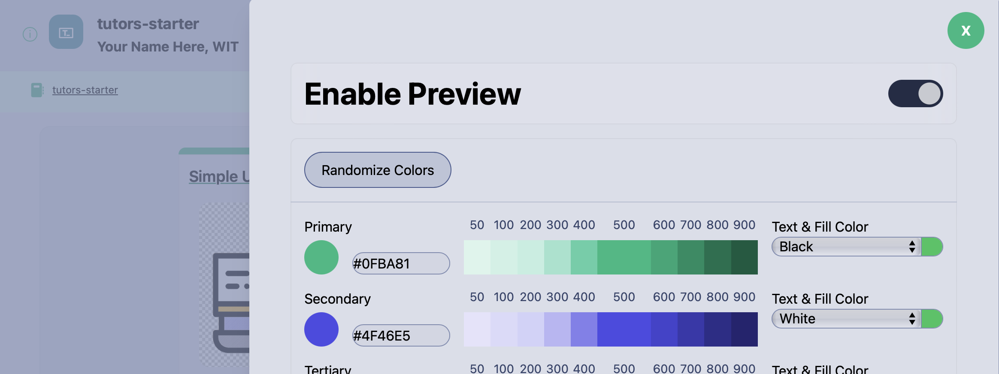

# Explore the Theme Builder

The tutors reader comes with a theme builder, located via the Layout menu:

This brings up a dialog revealing a full range of customisable design options:

Select "Enable Preview":

Make some adjustments to the colour schemes and note how the changes are reflected in the course.
