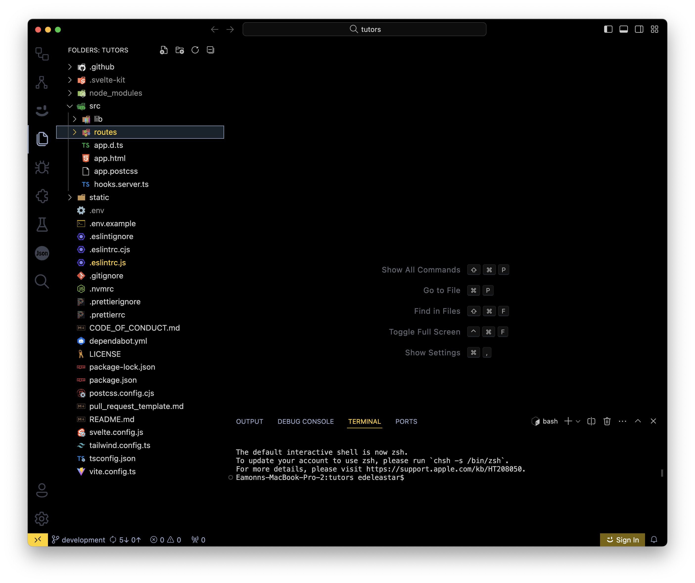
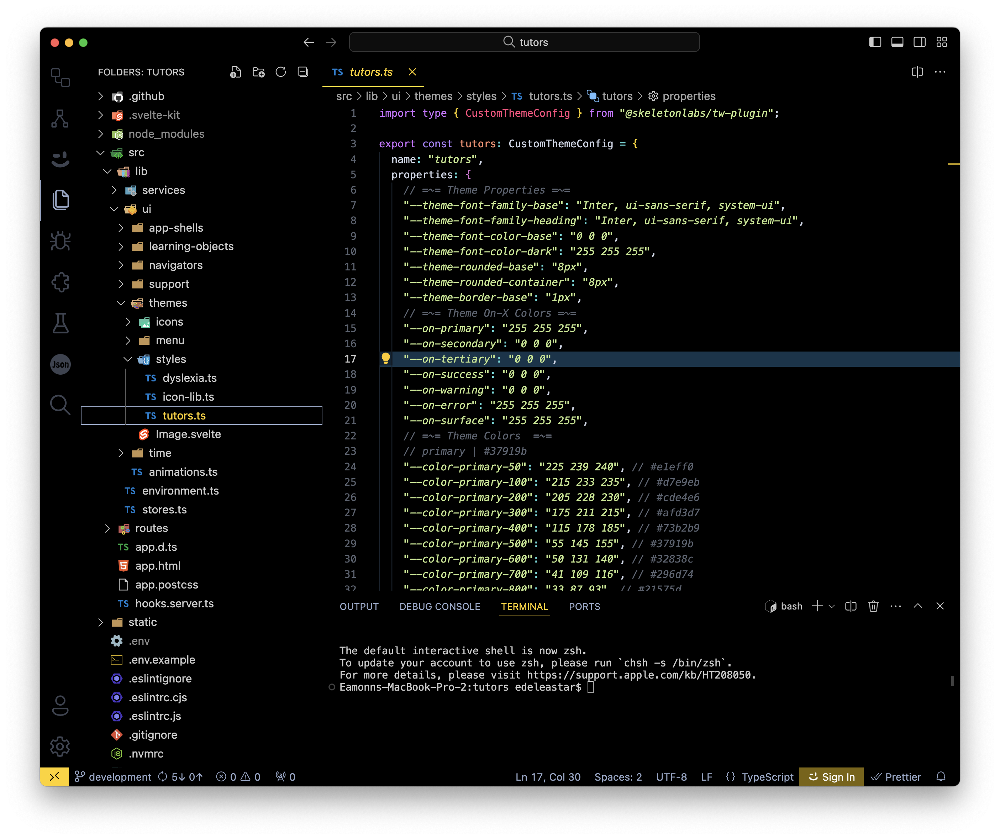
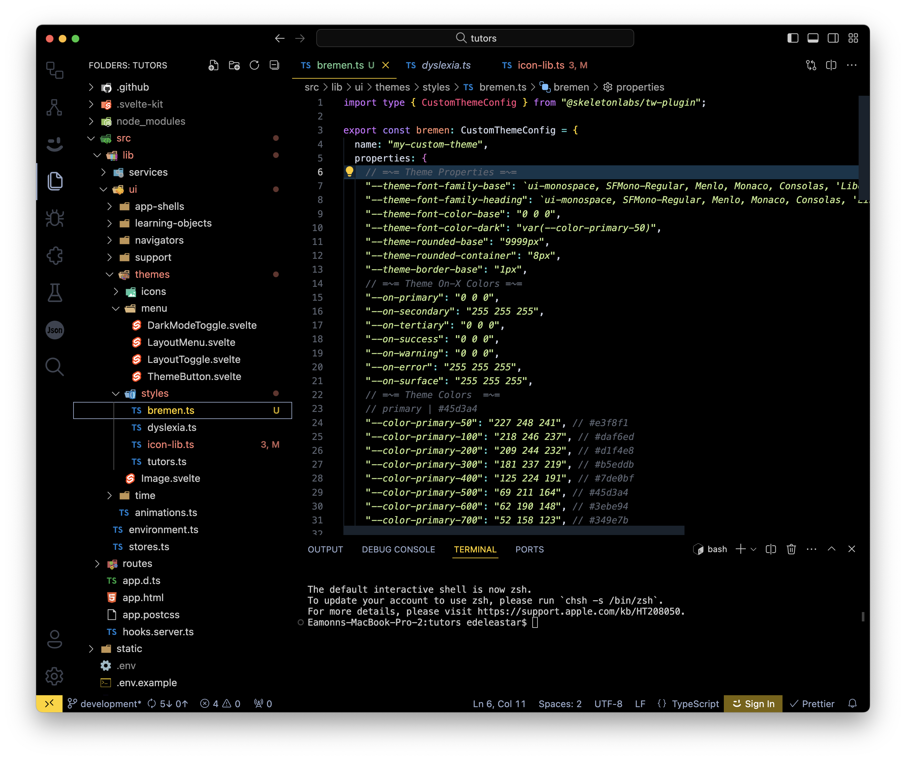

# Import Theme CSS

You should have cloned the tutors source repo already - we can open it now in VSCode:

Now locate the following folder:

- Src/lib/ui/themes/styles

We can see two themes here:

- dislexia.ts
- tutors.ts

Copy our new theme in here - call it anything you like, say:

- bremen.ts

Be sure to name the exported theme object to a name of your choice, say `bremen`:

~~~typescript
import type { CustomThemeConfig } from "@skeletonlabs/tw-plugin";

export const bremen: CustomThemeConfig = {
  name: "bremen",
  properties: {
    ...
    ...
~~~

Note that the object is called `Bremen` is the name property.
