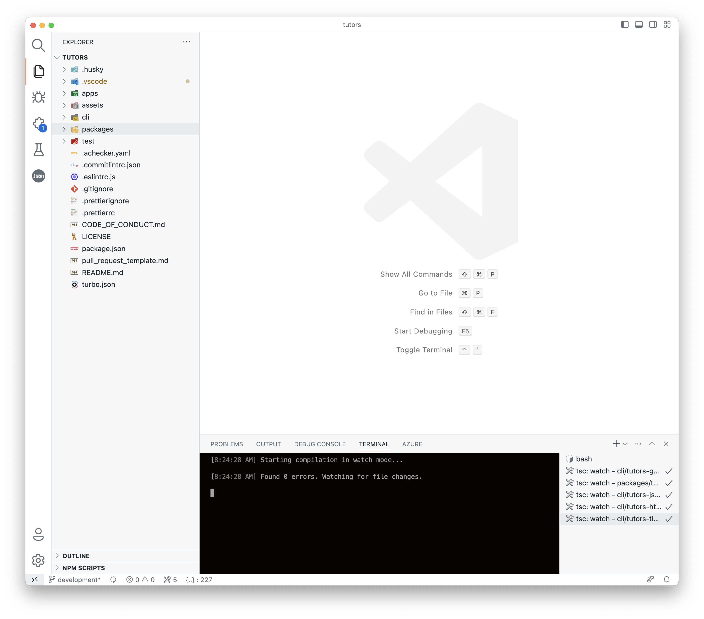
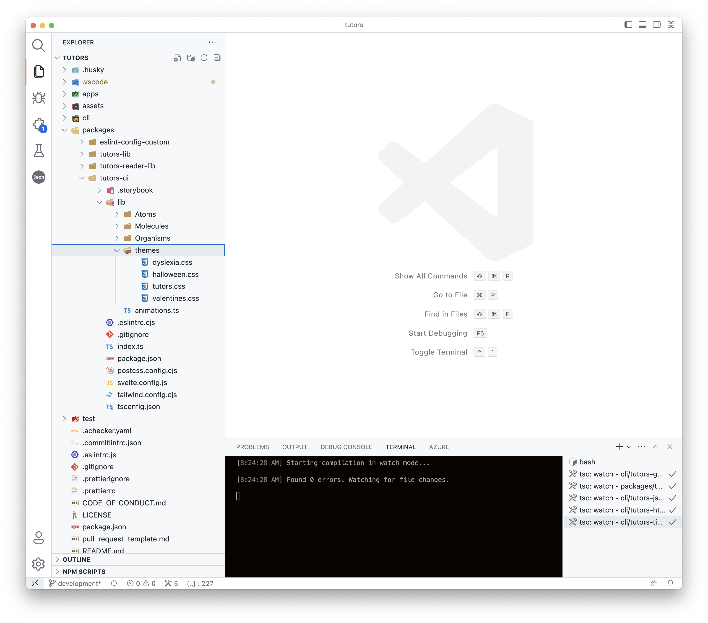
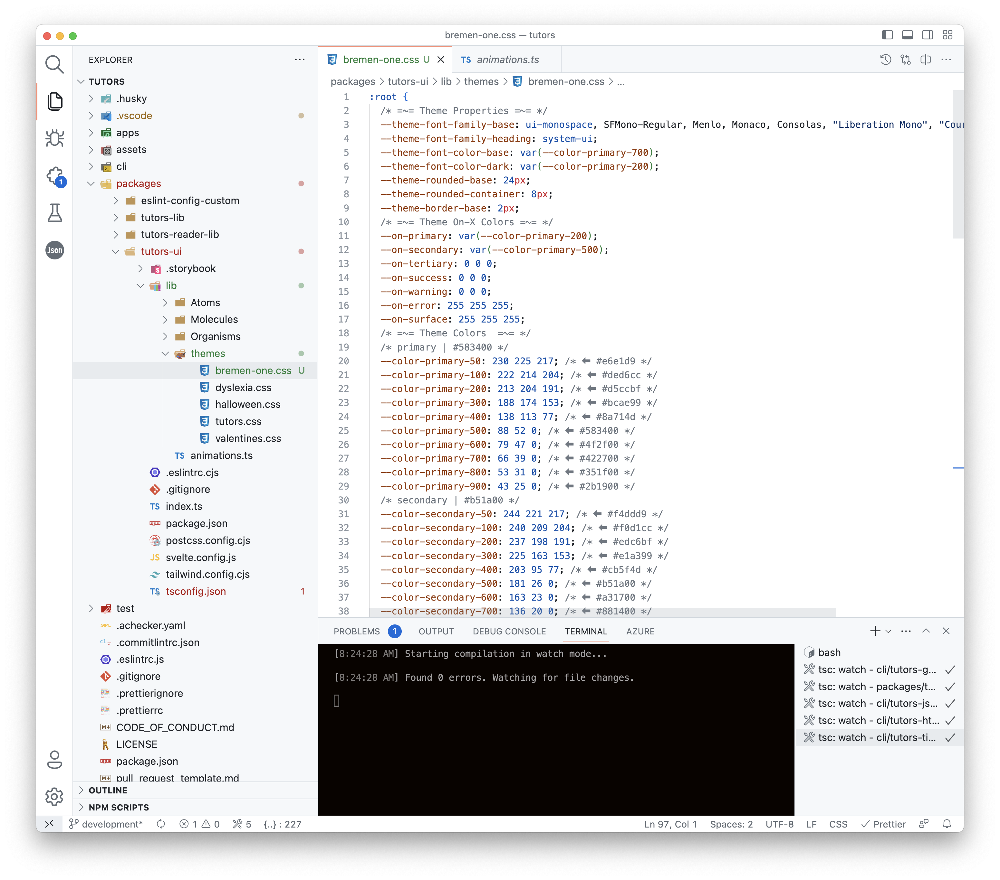

# Import Theme CSS

You should have cloned the tutors source repo already - we can open it now in VSCode:

This will take a moment or two to stabilise. Now locate the following folder:

- packages/tutors-ui/lib/themes

We can see fours themes here:

- dislexia.css
- haloween.css
- tutors.css
- valentines.css

Copy our new theme in here - call it anything you like, say:

- bremen-one.css

