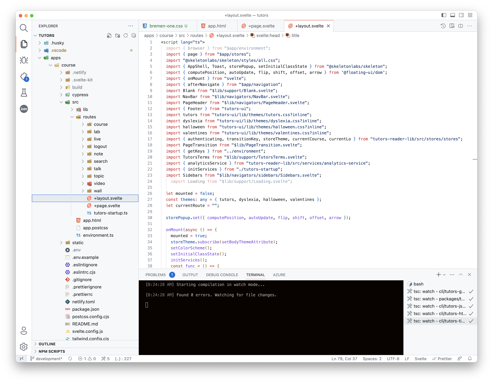
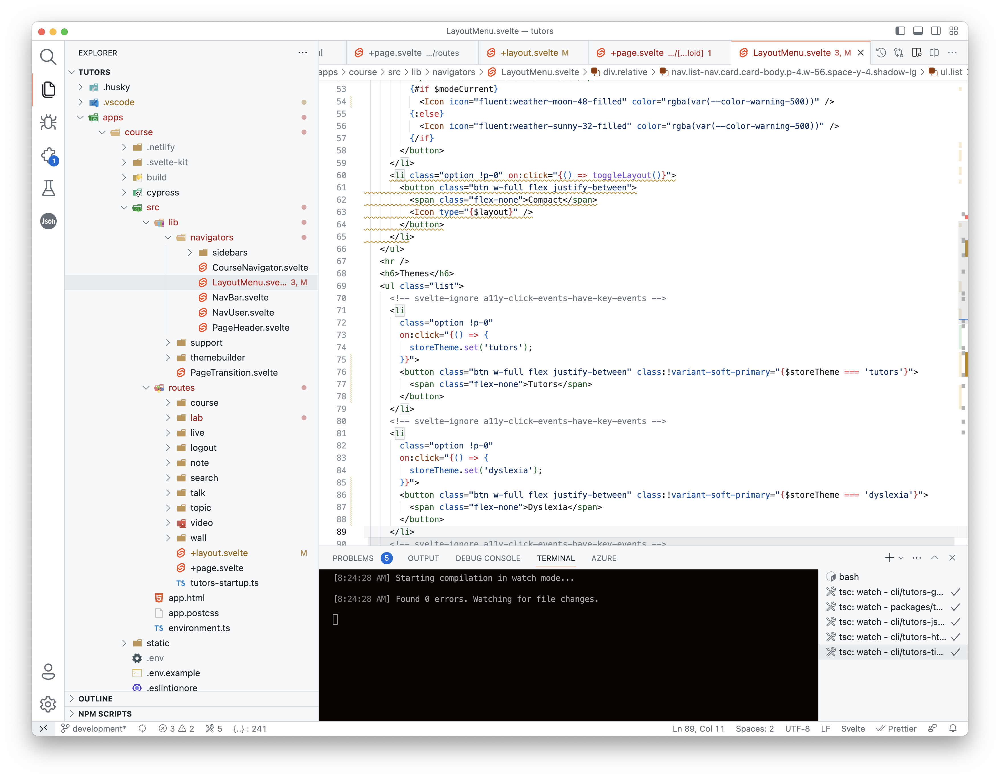
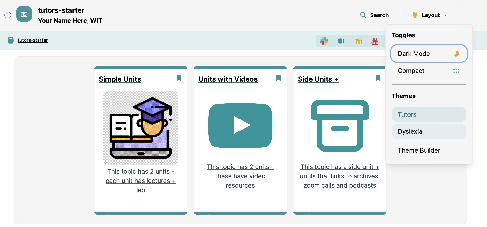
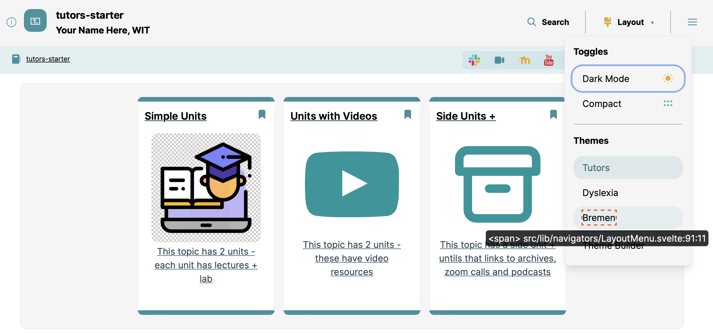
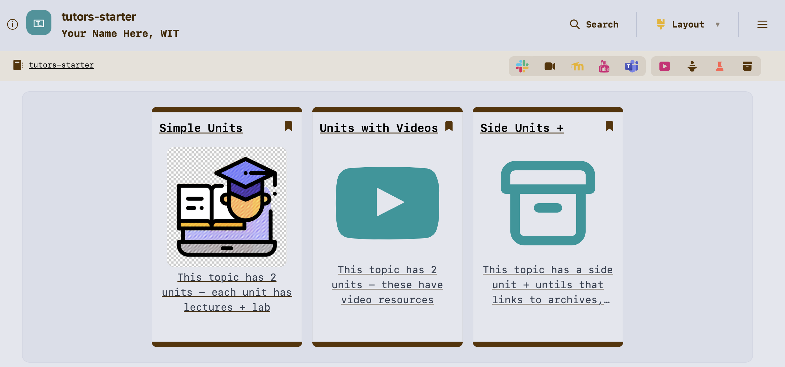

# Enable the Theme

Locate the following file in VSCode:

- apps/course/src/+layout.svelte

### apps/course/src/routes/+layout.svelte

Locate these three imports:

~~~typescript
  import tutors from "tutors-ui/lib/themes/tutors.css?inline";
  import dyslexia from "tutors-ui/lib/themes/dyslexia.css?inline";
  import halloween from "tutors-ui/lib/themes/halloween.css?inline";
  import valentines from "tutors-ui/lib/themes/valentines.css?inline"
~~~

Append our new theme to this import list:

~~~typescript
  import bremen from "tutors-ui/lib/themes/bremen-one.css?inline";
~~~

Locate this line just below:

~~~typescript
  const themes: any = { tutors, dyslexia, halloween, valentines };
~~~

Modify to include our newly imported theme:

~~~typescript
  const themes: any = { tutors, dyslexia, halloween, valentines, bremen };
~~~

### apps/course/src/lib/navigators/LayoutMenu.svelte

Finally, locate this file:

- Apps/course/src/lib/navigators/LayoutMenu.svelte

Locate these lines - at approximately line 80:

~~~html
      <!-- svelte-ignore a11y-click-events-have-key-events -->
      <li
        class="option !p-0"
        on:click="{() => {
          storeTheme.set('dyslexia');
        }}">
        <button class="btn w-full flex justify-between" class:!variant-soft-primary="{$storeTheme === 'dyslexia'}">
          Dyslexia
        </button>
      </li>
~~~

This defines an entry in the Layout menu (for the Dyslexia theme):

Duplicate these lines, replacing "dyslexia" with "bremen":

~~~html
      <!-- svelte-ignore a11y-click-events-have-key-events -->
      <li
        class="option !p-0"
        on:click="{() => {
          storeTheme.set('bremen');
        }}">
        <button class="btn w-full flex justify-between" class:!variant-soft-primary="{$storeTheme === 'bremen'}">
          Bremen
        </button>
      </li>
~~~

Once you have made this change, the theme should be available in the (local) reader:

It should be possible to activate:

