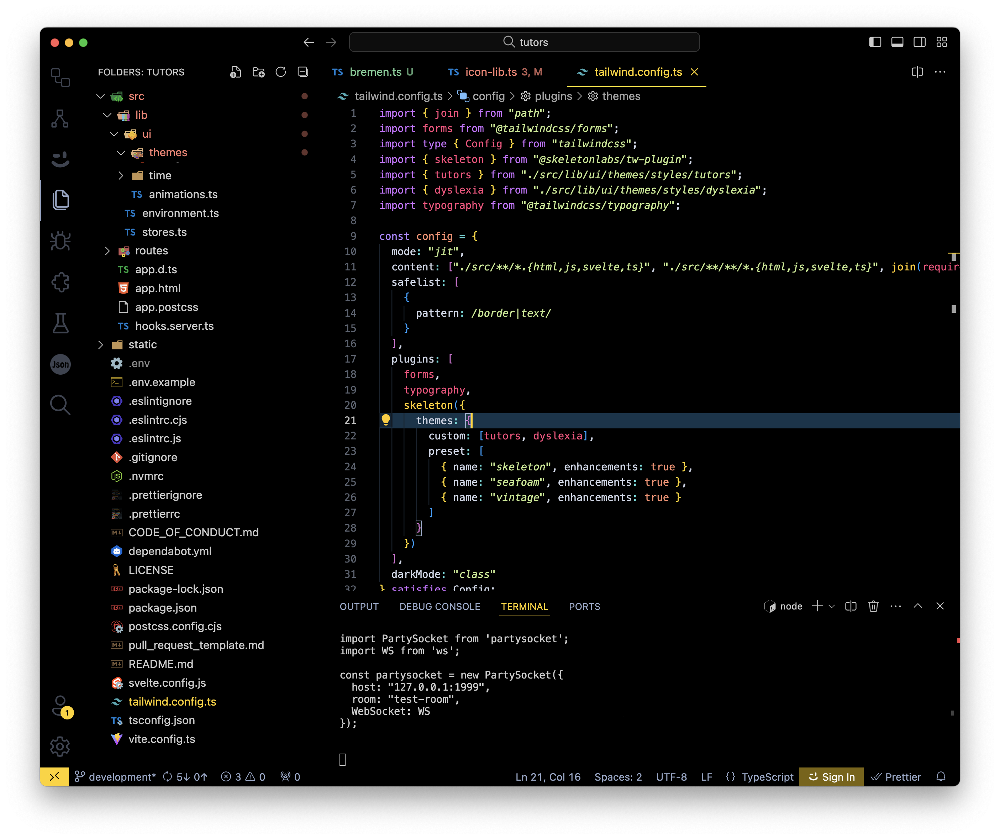

# Enable the Theme

Locate the following file in VSCode:

### src/lib/themes/styles/icon-lib.ts

The opening declarations define the themes + associated icons (more on icons in the next step):

~~~typescript
...
export const themes = ["tutors", "dyslexia", "bremen", "skeleton", "seafoam", "vintage"];

export const themeIcons = {
  tutors: FluentIconLib,
  dyslexia: FluentIconLib,
  bremen: FluentIconLib,
  skeleton: HeroIconLib,
  seafoam: FluentIconLib,
  vintage: HeroIconLib
};
~~~

In the above we have introduced the name of our new theme + a corresponding entry in the themeIcons table. 

Now locate this module: 

### tailwind.config.ts

Locate the `themes` table:

~~~typescript
//...
import { tutors } from "./src/lib/ui/themes/styles/tutors";
import { dyslexia } from "./src/lib/ui/themes/styles/dyslexia";
//...

    skeleton({
      themes: {
        custom: [tutors, dyslexia],
        preset: [
          { name: "skeleton", enhancements: true },
          { name: "seafoam", enhancements: true },
          { name: "vintage", enhancements: true }
        ]
      }
    })
~~~

Extend this to include the new theme (as well as importing the theme object):

~~~typescript
//...
import { tutors } from "./src/lib/ui/themes/styles/tutors";
import { dyslexia } from "./src/lib/ui/themes/styles/dyslexia";
import { bremen } from "./src/lib/ui/themes/styles/bremen";
//...

    skeleton({
      themes: {
        custom: [tutors, dyslexia, bremen],
        preset: [
          { name: "skeleton", enhancements: true },
          { name: "seafoam", enhancements: true },
          { name: "vintage", enhancements: true }
        ]
      }
    })
~~~

The new theme should now be available:

