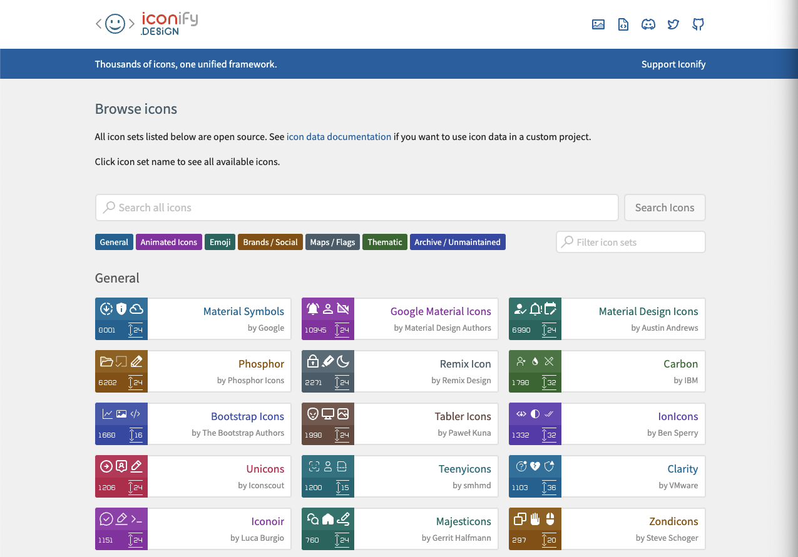
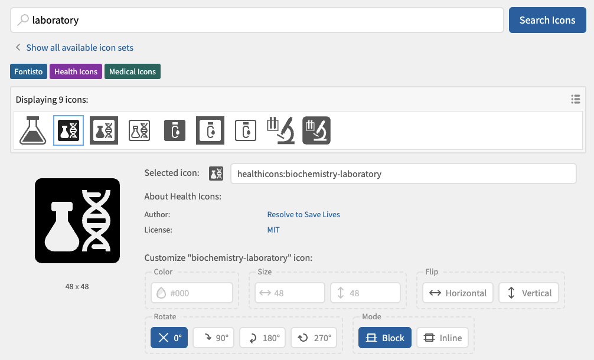

# Changing IconSet

The icons are generated from this system here:

- [Iconify](https://icon-sets.iconify.design/) 

Explore/search for some interesting icons. For example [healthicons:biochemistry-laboratory](https://icon-sets.iconify.design/healthicons/biochemistry-laboratory/):

In the tutors project if VSCode, locate the themes.ts module:

- packages/tutors-ui/lib/atoms/icon/themes.ts

Line 4 contains this line:

~~~typescript
let StandardIconLib = FluentIconLib;
~~~

This has imported the icons defined in this file:

- packages/tutors-ui/lib/atoms/support/fluent-icons.ts

~~~typescript
export const FluentIconLib = {
  // Home Icon
  programHome: { icon: "fluent:home-24-filled", colour: "success" },

  // companion Icons
  slack: { icon: "logos:slack-icon", colour: "error" },
  moodle: { icon: "academicons:moodle", colour: "warning" },
  youtube: { icon: "fa:youtube", colour: "error" },
  video: { icon: "fluent:video-clip-24-filled", colour: "error" },
  zoom: { icon: "fluent:video-24-filled", colour: "primary" },
  teams: { icon: "logos:microsoft-teams", colour: "bg-base-content" },

  // LoTypes icons
  course: { icon: "fluent:notebook-24-filled", colour: "primary" },
  topic: { icon: "fluent:bookmark-24-filled", colour: "primary" },
  unit: { icon: "fluent:dual-screen-group-24-filled", colour: "success" },
  side: { icon: "fluent:dual-screen-group-24-filled", colour: "success" },
  talk: { icon: "fluent:presenter-24-filled", colour: "primary" },
  reference: { icon: "fluent:document-copy-24-filled", colour: "warning" },
  lab: { icon: "fluent:beaker-24-filled", colour: "success" },
  archive: { icon: "fluent:archive-24-filled", colour: "primary" },
  web: { icon: "fluent:bookmark-24-regular", colour: "error" },
  github: { icon: "fluent:code-circle-20-filled", colour: "warning" },
  panelvideo: { icon: "fluent:video-clip-24-regular", colour: "error" },
  paneltalk: { icon: "fluent:presenter-24-filled", colour: "primary" },
  note: { icon: "fluent:notepad-16-regular", colour: "warning" },
  panelnote: { icon: "fluent:notepad-16-regular", colour: "warning" },

  // pdf reader icons
  left: { icon: "fluent:ios-arrow-left-24-filled", colour: "success" },
  right: { icon: "fluent:ios-arrow-right-24-filled", colour: "success" },
  print: { icon: "fluent:print-24-filled", colour: "success" },
  rotate: { icon: "fluent:arrow-rotate-clockwise-24-filled", colour: "success" },
  download: { icon: "fluent:arrow-download-24-filled", colour: "success" },
  fullScreen: { icon: "fluent:arrow-expand-24-filled", colour: "success" },

  // tutors time icons
  online: { icon: "fluent:presence-available-24-filled", colour: "success" },
  offline: { icon: "fluent:presence-available-24-regular", colour: "error" },
  tutorsTime: { icon: "fluent:clock-alarm-24-filled", colour: "primary" },
  timeExport: { icon: "fluent:save-arrow-right-24-filled", colour: "success" },
  live: { icon: "fluent:people-community-24-filled", colour: "success" },

  // app icons
  search: { icon: "fluent:search-24-filled", colour: "primary" },
  tutors: { icon: "fa-solid:chalkboard-teacher", colour: "bg-base-content" },
  logout: { icon: "fluent:sign-out-24-filled", colour: "error" },
  dark: { icon: "fluent:paint-brush-24-filled", colour: "warning" },
  toc: { icon: "fluent:line-horizontal-3-20-filled", colour: "bg-base-content" },
  compacted: { icon: "fluent:re-order-dots-vertical-24-filled", colour: "success" },
  expanded: { icon: "fluent:re-order-dots-horizontal-24-filled", colour: "success" },
  courseinfo: { icon: "fluent:info-28-regular", colour: "bg-base-content" },
  calendar: { icon: "fluent:calendar-ltr-12-regular", colour: "bg-base-content" },
  appSettings: { icon: "fluent:settings-24-filled", colour: "primary" },
  listOnline: { icon: "fluent:people-list-24-filled", colour: "primary" },

  default: { icon: "fluent:re-order-dots-vertical-24-filled", colour: "error" }
};
~~~

The `icon` string in each entry above can be replaced from with `selected icon` string from Iconify (see screen shot of Iconify above).

Alternatively, you can create a new module modelled on the above, keeping the exact same structure (but different icon strings). There are some examples above. Then you can make sure you import the object name from the module, set it as the default in themes.ts:

~~~typescript
import { FluentIconLib } from "./support/fluent-icons";
...

let StandardIconLib = FluentIconLib;
~~~

So you might have something like this for instance:

~~~typescript
import { NewThemeIcons } from "./support/new-theme-icons";
...

let StandardIconLib = NewThemeIcons;
~~~

Your new icons should be visible on your local version of tutors:

- <http://localhost:3000/course/tutors-starter>
