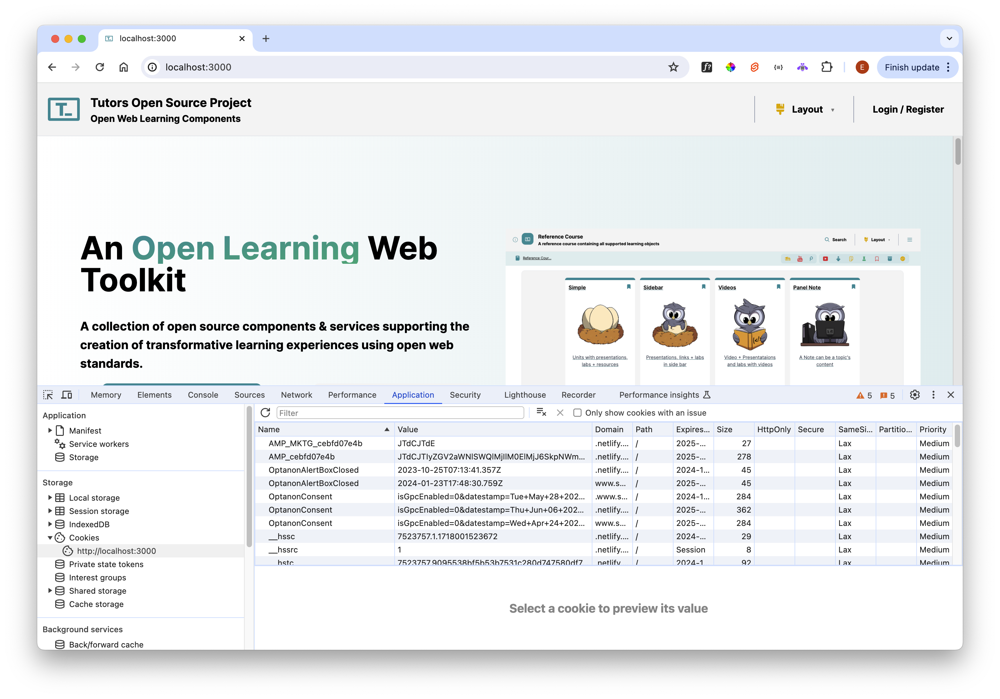

# Cookie Reset

For come courses, authentication is required. In development, this may lead to cookie security errors locally, requiring the cookie to be removed before the local tutors reader can successfully launch.

If this occurs, the error will be apparent in the terminal (within VSCode):

~~~bash
throw new Error('Cannot use `cookies.set(...)` after the response has been generated');
                                      ^
Error: Cannot use `cookies.set(...)` after the response has been generated
...
...
~~~

To clear the cookies, right click and select 'clear' on http://localhost:3000

Restart the app in terminal:

~~~bash
npm run dev
 VITE v5.2.11  ready in 856 ms

  ➜  Local:   http://localhost:3000/
  ➜  Network: use --host to expose
  ➜  press h + enter to show help
~~~

The Tutors Reader should launch successfully:

