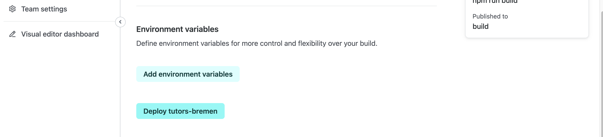
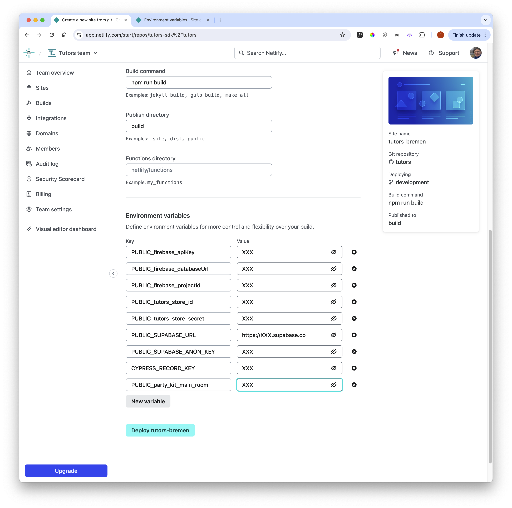
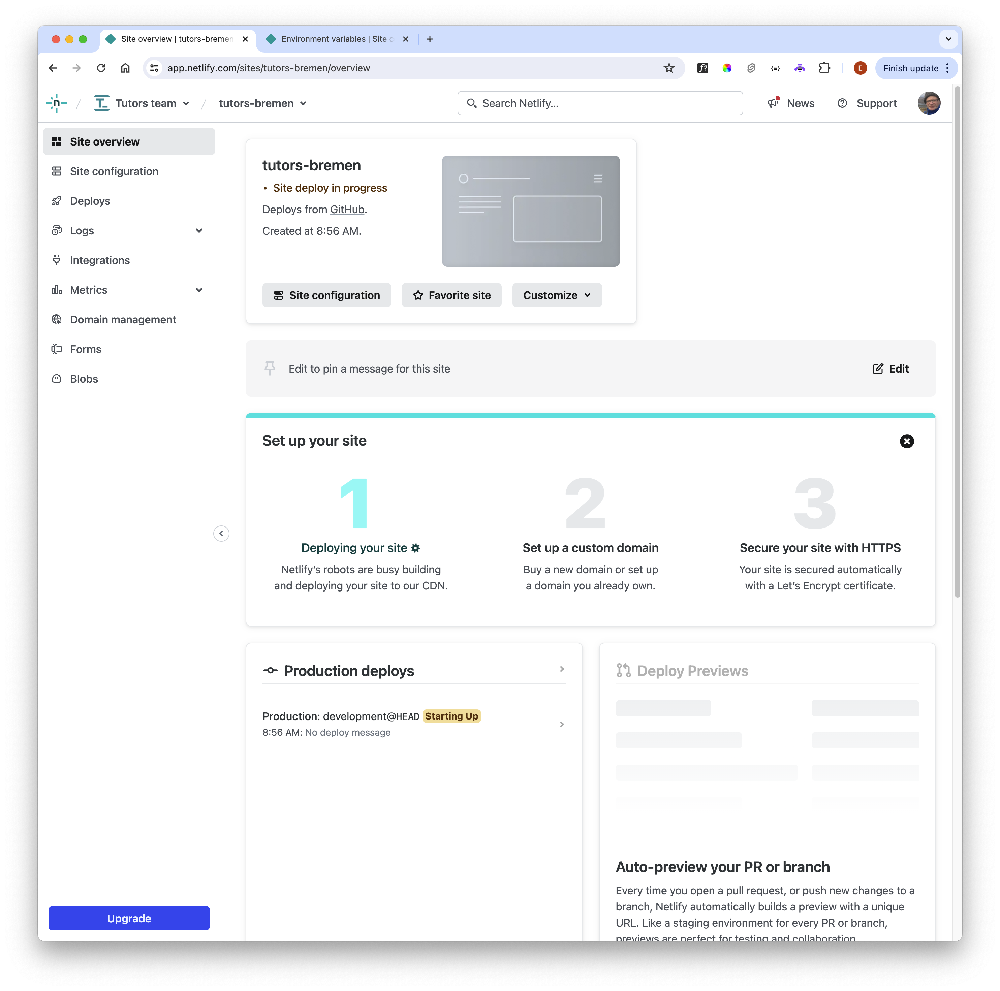
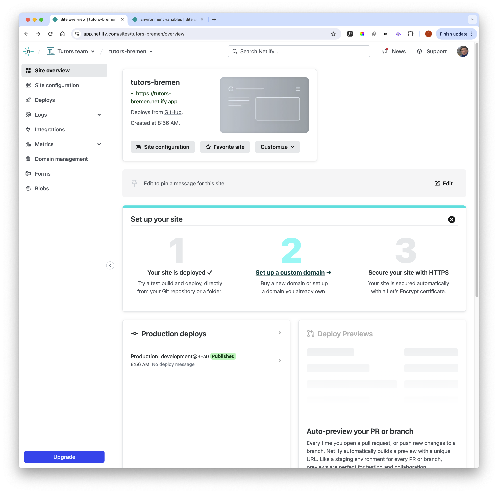
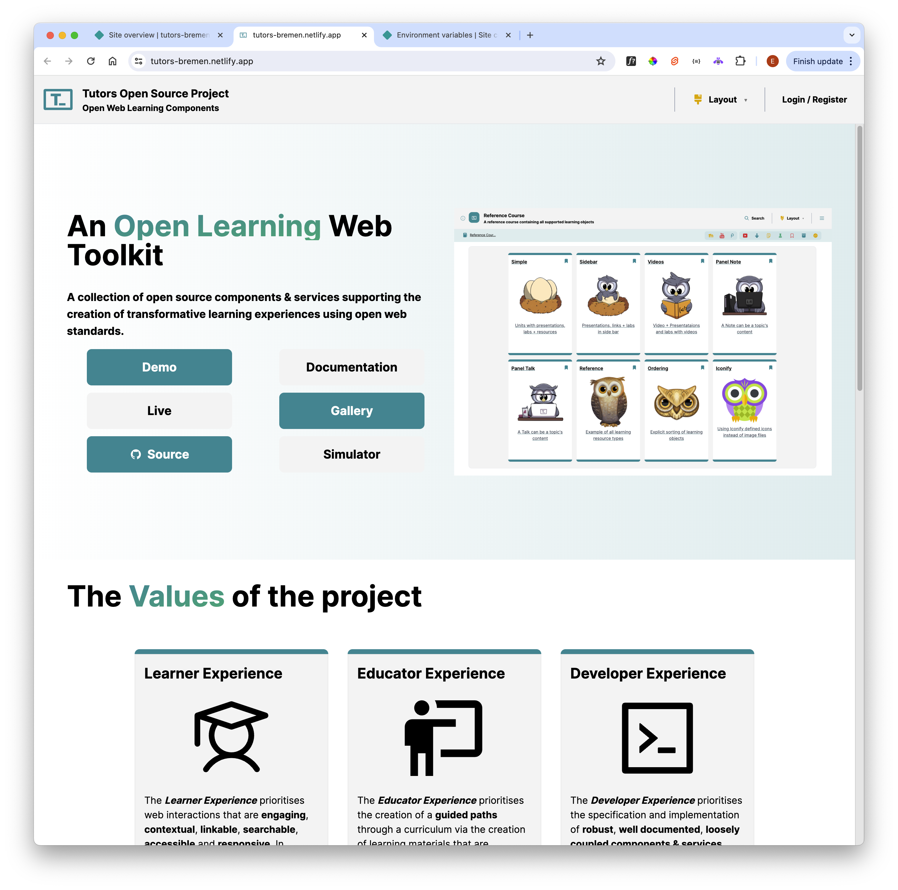
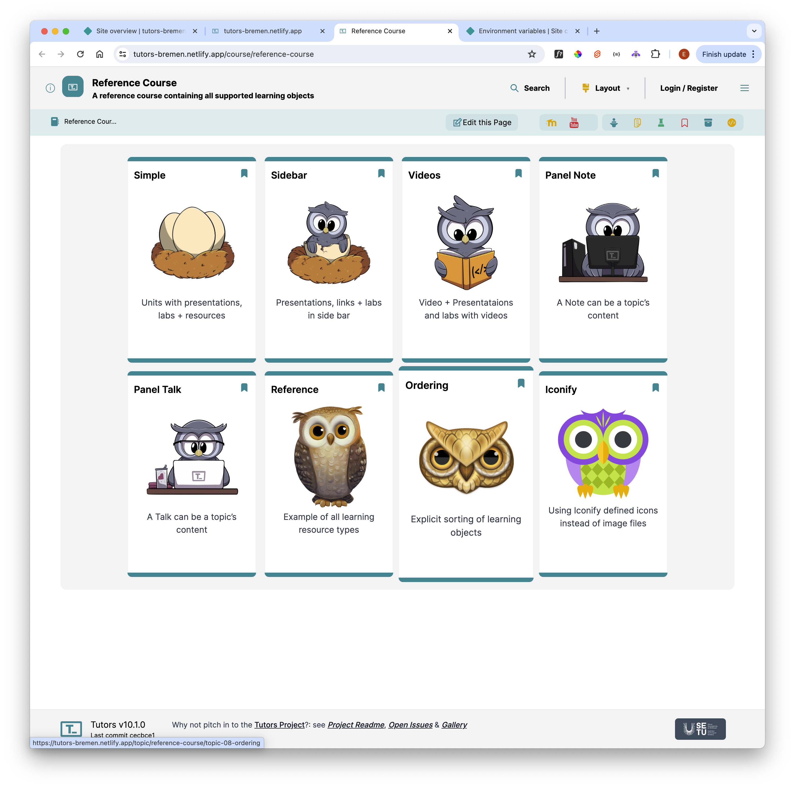

# Environment Variables

Our environment variables, defined in .env (copied from .env.example) look like this:

~~~bash
PUBLIC_firebase_apiKey = "XXX"
PUBLIC_firebase_databaseUrl=  "XXX"
PUBLIC_firebase_projectId = "XXX"
PUBLIC_tutors_store_id = "XXX"
PUBLIC_tutors_store_secret= "XXX"

PUBLIC_SUPABASE_URL="https://XXX.supabase.co"
PUBLIC_SUPABASE_ANON_KEY="XXX"
CYPRESS_RECORD_KEY="XXX"

PUBLIC_party_kit_main_room="XXX"
~~~

We need to define these in our project in order for it to build successfully.

On the project Scroll down, and select 'Add environment variables'

Define variable for each of the values listed above:

Be sure to include a url for PUBLIC_SUPABASE_URL

The press 'Deploy ...' button:

The build will take a few minutes, if all goes well you should see it marked 'published':

This link will appear just below the site title. If the build has succeeded, then you should have a new reader deployed:

Selecting 'Demo' will open the reference course:

