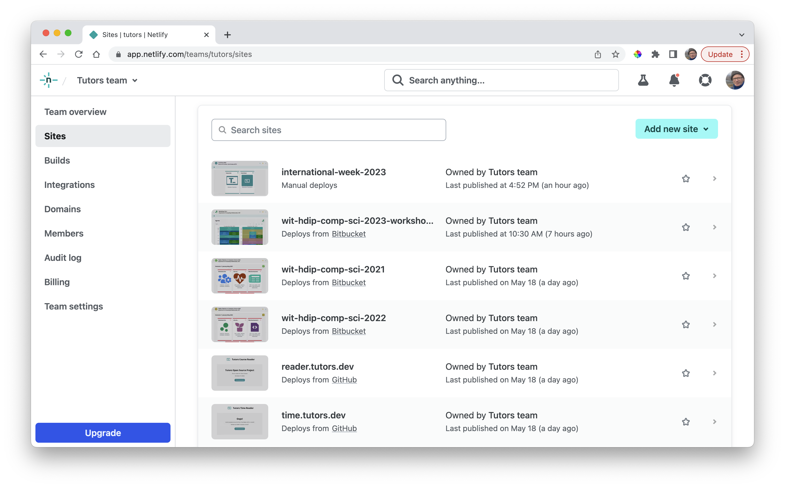
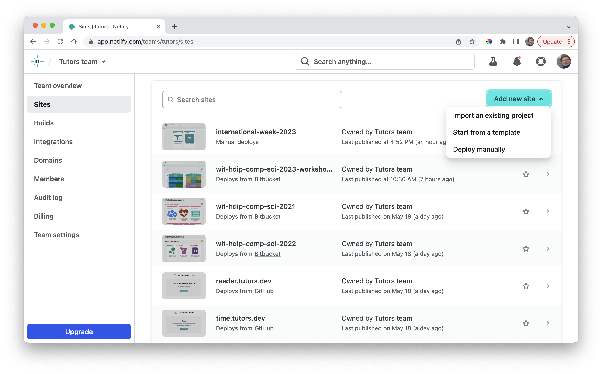
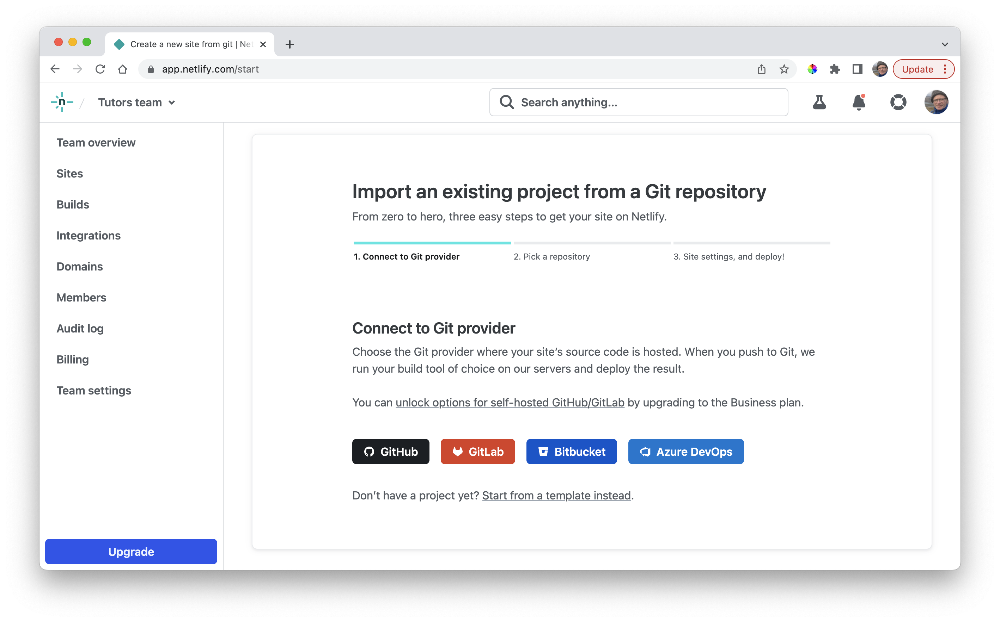
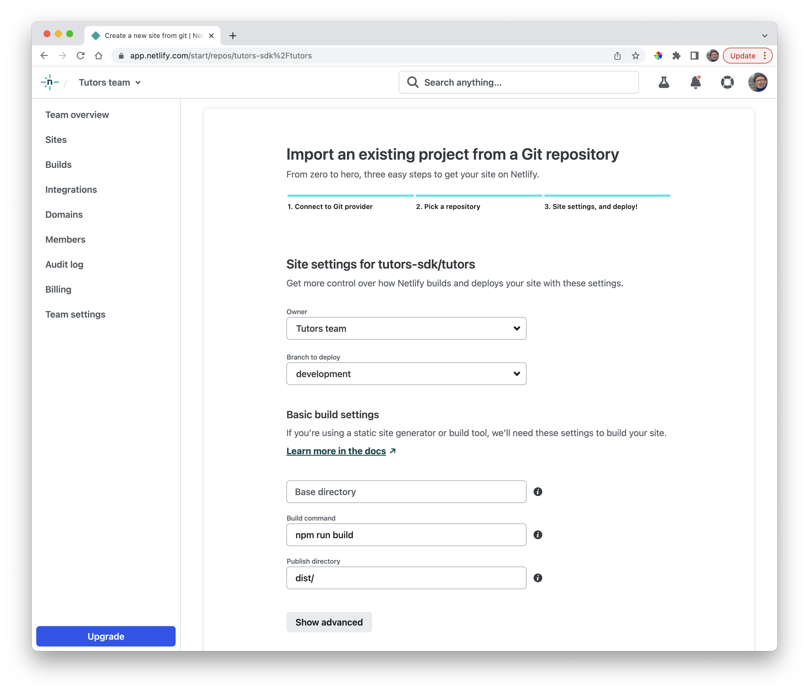
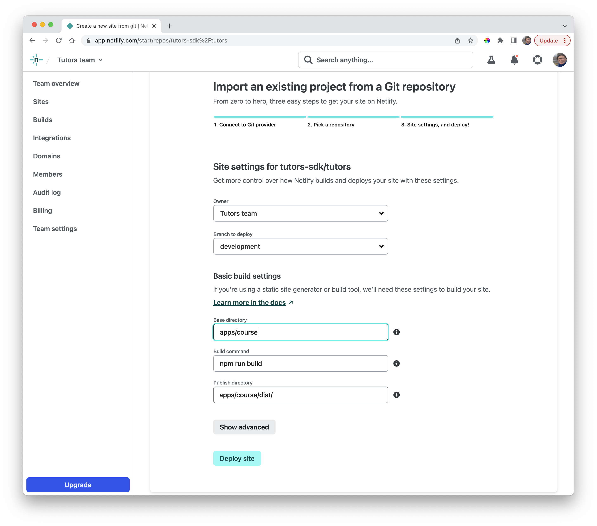
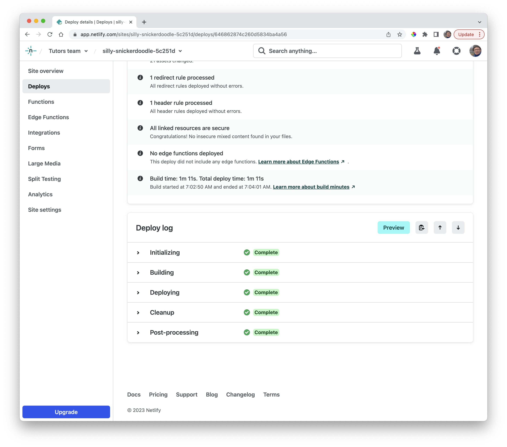

# Netlify Build

On your Netlify dashboard, locate the Sites page:

You may see some of the course you deployed here. In the above example, we have this workshop deployed (first entry), and also the Tutors reader itself (5th row).

Select `Add New Site` and select `Import Existing Project`:

Select `Github`:

In the subsequent dialogs, authorise Netlify to access your Github account and select the tutors monorepo (your forked copy) as the project to deploy:

You will need to customise these fields:

- Branch: development
- Base directory: apps/course
- Build Command: npm run build
- Publish Directory: apps/course/dist/

Press `Deploy Site`

Deployment should succeed - the build taking a minute or so.

